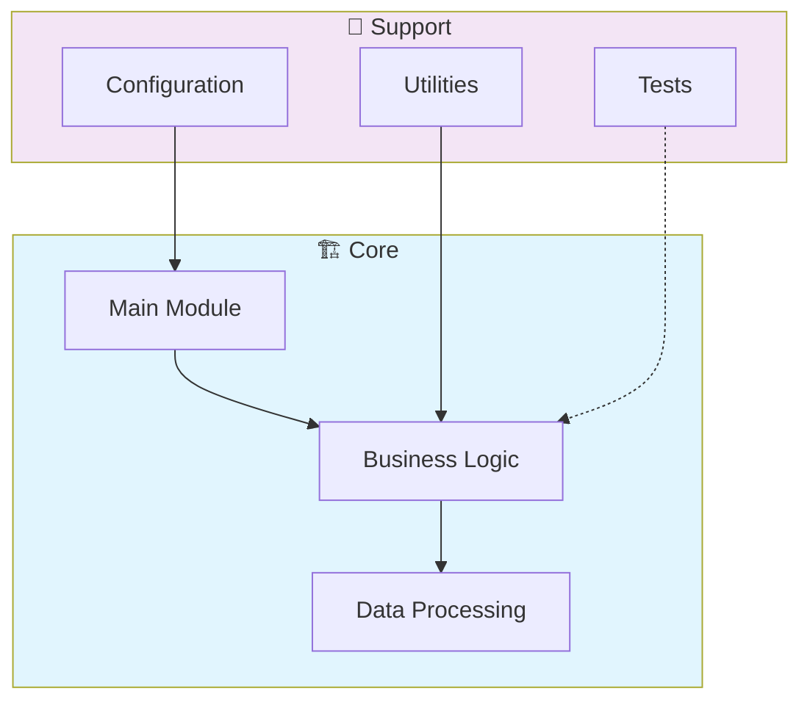

# 📊 Dbt Data Warehouse Modeling

> Data warehouse modeling project using dbt (data build tool). Implements dimensional modeling, data marts, and automated testing for analytics-ready data transformations.

[](https://img.shields.io/badge/)
[](LICENSE)

[English](#english) | [Português](#português)

---

## English

### 🎯 Overview

**Dbt Data Warehouse Modeling** is a production-grade SQL application that showcases modern software engineering practices including clean architecture, comprehensive testing, containerized deployment, and CI/CD readiness.

The codebase comprises **763 lines** of source code organized across **18 modules**, following industry best practices for maintainability, scalability, and code quality.

### ✨ Key Features

- **🔄 Data Pipeline**: Scalable ETL with parallel processing
- **✅ Data Validation**: Schema validation and quality checks
- **📊 Monitoring**: Pipeline health metrics and alerting
- **🔧 Configurability**: YAML/JSON-based pipeline configuration

### 🏗️ Architecture



### 🚀 Quick Start

#### Prerequisites

- PostgreSQL 15+ or compatible database
- dbt (if using dbt models)

#### Installation

```bash
git clone https://github.com/galafis/dbt-data-warehouse-modeling.git
cd dbt-data-warehouse-modeling
```

### 🧪 Testing

Run the test suite to verify everything works correctly.

### 📁 Project Structure

```
dbt-data-warehouse-modeling/
├── docs/          # Documentation
│   ├── ARCHITECTURE.md
│   ├── DATA_FLOW.md
│   ├── FAQ.md
│   └── TROUBLESHOOTING.md
├── images/
├── macros/
│   ├── tests/         # Test suite
│   │   └── accepted_range.sql
│   ├── cents_to_dollars.sql
│   ├── generate_schema_name.sql
│   └── surrogate_key.sql
├── models/        # Data models
│   ├── intermediate/
│   │   ├── _intermediate.yml
│   │   ├── int_customer_metrics.sql
│   │   └── int_orders_enriched.sql
│   ├── marts/
│   │   ├── core/          # Core configuration
│   │   └── metrics/
│   └── staging/
│       ├── _staging.yml
│       ├── stg_customers.sql
│       ├── stg_orders.sql
│       └── stg_products.sql
├── seeds/
├── snapshots/
│   └── orders_snapshot.sql
├── tests/         # Test suite
│   ├── assert_customers_have_orders.sql
│   ├── assert_positive_revenue.sql
│   └── assert_valid_dates.sql
├── CONTRIBUTING.md
├── INSTALL.md
├── LICENSE
├── README.md
└── dbt_project.yml
```

### 🛠️ Tech Stack

| Technology | Description | Role |
|------------|-------------|------|
| **SQL** | Core Language | Primary |

### 🤝 Contributing

Contributions are welcome! Please feel free to submit a Pull Request. For major changes, please open an issue first to discuss what you would like to change.

1. Fork the project
2. Create your feature branch (`git checkout -b feature/AmazingFeature`)
3. Commit your changes (`git commit -m 'Add some AmazingFeature'`)
4. Push to the branch (`git push origin feature/AmazingFeature`)
5. Open a Pull Request

### 📄 License

This project is licensed under the MIT License - see the [LICENSE](LICENSE) file for details.

### 👤 Author

**Gabriel Demetrios Lafis**
- GitHub: [@galafis](https://github.com/galafis)
- LinkedIn: [Gabriel Demetrios Lafis](https://linkedin.com/in/gabriel-demetrios-lafis)

---

## Português

### 🎯 Visão Geral

**Dbt Data Warehouse Modeling** é uma aplicação SQL de nível profissional que demonstra práticas modernas de engenharia de software, incluindo arquitetura limpa, testes abrangentes, implantação containerizada e prontidão para CI/CD.

A base de código compreende **763 linhas** de código-fonte organizadas em **18 módulos**, seguindo as melhores práticas do setor para manutenibilidade, escalabilidade e qualidade de código.

### ✨ Funcionalidades Principais

- **🔄 Data Pipeline**: Scalable ETL with parallel processing
- **✅ Data Validation**: Schema validation and quality checks
- **📊 Monitoring**: Pipeline health metrics and alerting
- **🔧 Configurability**: YAML/JSON-based pipeline configuration

### 🏗️ Arquitetura


### 🚀 Início Rápido

#### Prerequisites

- PostgreSQL 15+ or compatible database
- dbt (if using dbt models)

#### Installation

```bash
git clone https://github.com/galafis/dbt-data-warehouse-modeling.git
cd dbt-data-warehouse-modeling
```

### 🧪 Testing

Run the test suite to verify everything works correctly.

### 📁 Estrutura do Projeto

```
dbt-data-warehouse-modeling/
├── docs/          # Documentation
│   ├── ARCHITECTURE.md
│   ├── DATA_FLOW.md
│   ├── FAQ.md
│   └── TROUBLESHOOTING.md
├── images/
├── macros/
│   ├── tests/         # Test suite
│   │   └── accepted_range.sql
│   ├── cents_to_dollars.sql
│   ├── generate_schema_name.sql
│   └── surrogate_key.sql
├── models/        # Data models
│   ├── intermediate/
│   │   ├── _intermediate.yml
│   │   ├── int_customer_metrics.sql
│   │   └── int_orders_enriched.sql
│   ├── marts/
│   │   ├── core/          # Core configuration
│   │   └── metrics/
│   └── staging/
│       ├── _staging.yml
│       ├── stg_customers.sql
│       ├── stg_orders.sql
│       └── stg_products.sql
├── seeds/
├── snapshots/
│   └── orders_snapshot.sql
├── tests/         # Test suite
│   ├── assert_customers_have_orders.sql
│   ├── assert_positive_revenue.sql
│   └── assert_valid_dates.sql
├── CONTRIBUTING.md
├── INSTALL.md
├── LICENSE
├── README.md
└── dbt_project.yml
```

### 🛠️ Stack Tecnológica

| Tecnologia | Descrição | Papel |
|------------|-----------|-------|
| **SQL** | Core Language | Primary |

### 🤝 Contribuindo

Contribuições são bem-vindas! Sinta-se à vontade para enviar um Pull Request.

### 📄 Licença

Este projeto está licenciado sob a Licença MIT - veja o arquivo [LICENSE](LICENSE) para detalhes.

### 👤 Autor

**Gabriel Demetrios Lafis**
- GitHub: [@galafis](https://github.com/galafis)
- LinkedIn: [Gabriel Demetrios Lafis](https://linkedin.com/in/gabriel-demetrios-lafis)
