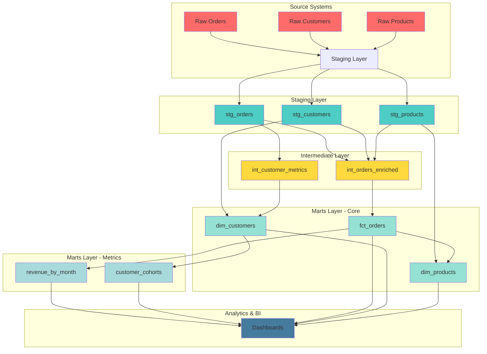

# Data Flow Diagram

## Model Dependencies

The lineage shows how data flows through the layers:
- **Staging** models clean and standardize raw data
- **Intermediate** models add business logic and enrichment
- **Marts** models provide analytics-ready tables for BI tools
